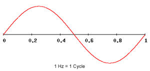

```{r setup, include=FALSE}
knitr::opts_chunk$set(echo = TRUE)
library(ggplot2)
library(behaviouR)
library(tuneR)
library(seewave)
library(dplyr)
```

# Wildlife acoustic data
Audio data is becoming increasingly important in ecology and conservation. Whilst devices such as bat detectors have been used for many years, the advent of recording equipment left in the field to detect sounds has resulted in a much larger pool of data to draw on. Data is therefore not only collected by handheld devices, but also in camera traps (which sometimes monitor sound at the same time as a photograph and/or video), and also passive acoustic monitoring (PAM) devices such as the open source hardware system audioMoth <https://www.openacousticdevices.info/>. Audio data has a wide range of uses including:

* detection of illegal poaching in game reserves <add ref>
* monitor elephant behaviours <https://www.birds.cornell.edu/ccb/elephant-listening-project/>
* better understand and conserve animals based on overall soundscapes <https://doi-org.libproxy.ncl.ac.uk/10.1111/csp2.72>
* automatically identify species from their calls using machine learning <https://doi.org/10.1111/2041-210X.13357>

## Aims of this practical
The overall aim is to help you understand how to import audio data into R, undertake basic processing, learn about the concepts of Fast Fourier Transform (FFT) and creation of spectrograms, and how to compare different audio datasets. Many analytical methods are based on the `seewave` package but this has quite a steep learning curve, and other packages that access functions within `seewave` are easier to get started with for ecologists. Two particularly good packages are:

* `warbleR` This, with its associated paper in Methods in Ecology & Evolution, provides an end-to-end workflow for analysis of bioacoustic data. It is available on CRAN, and auto-installs `seewave` and `NatureSounds`. The latter includes lots of example audio data.
* `behaviouR` This is considerably easier to use, as it is aimed at teaching the main principles, but nevertheless is very powerful. We will use it in this practical. It is not available on CRAN, but a free online book is available at <https://bookdown.org/djc426/behaviouR-R-package-tutorials/> and this practical is derived from Chapter 3 of that text.

# Getting started
Begin by creating a new RStudio Project. If you wish, create it initially on GitHub and then initialise it from the version control option within RStudio. Then you can get into the habit of tracking and updating changes as you progress. Install and load the `behaviouR` package. When you install `behaviouR` it will also install the `tuneR` and `seewave` packages, which you may as well load to access their functions conveniently:

```{r, eval=FALSE}
# Install devtools from CRAN if not already done
install.packages("devtools")
devtools::install_github("https://github.com/DenaJGibbon/behaviouR")

library(behaviouR)
library(tuneR)
library(seewave)
library(ggplot2)
library(dplyr)
```

Next, create an R script within your RStudio Project to store the commands you are using for this practical example.

# Southeast Asian monkey recordings
We'll begin by downloading some sample data that has been provided for use with the `behaviouR` R package. To keep your audio data organised, we'll store them in a subfolder called `FocalRecordings`. The phrase _"Focal Recording"_ refers to all the audio events produced by an animal in a specified time-period, i.e when the audio equipment is recording. Ideally, all the sounds produced by **one** animal are recorded, although in practice lots of animals in the overall soundscape will be recorded in most situations.

The audio files are actually available on GitHub, and we can use the following commands to create your `FocalRecordings` subfolder, and extract the sound files:

```{r}
# Now we will create folder in your RStudio Project called 'FocalRecordings'
dir.create(file.path("FocalRecordings"), showWarnings = FALSE)

# Now we will load the sound files that were in the behaviouR package
githubURL <- "https://github.com/DenaJGibbon/behaviouRdata/raw/master/data/FocalRecordings.rda"
FocalRecordings <- get(load(url(githubURL)))

# Now we will save the recordings to the new folder you created as standard
# audio .wav format files; You do not need to understand the next set of code
# in detail
for (a in 1:length(FocalRecordings)) {
    FileName <- FocalRecordings[[a]][1][[1]]
    WaveFile <- FocalRecordings[[a]][2][[1]]
    writeWave(WaveFile, paste("FocalRecordings/", FileName, sep = ""))
}
```

After the files have been uncompressed, go to your File Explorer (Windows) or Finder (Apple Mac) and you will see a set of **.wav** files have been created. The .wav format is a standard one for audio data - you should be able to double click on one of these files and depending on your system settings hear the content. Each one is about 10 seconds long: whilst you can hear the call of the individual monkey, there is also lots of background noise, such as birds, insect cicadas clicking etc.

# Importing and displaying an individual `.wav` file
Begin by importing the first female gibbon sound recording wave file, using the `readWave` function, which is part of the `tuneR` package:

```{r}
GibbonWaveFile <- readWave("FocalRecordings/FemaleGibbon_1.wav")
GibbonWaveFile
```

What we see is that the soundfile is ~13 seconds long, was recorded at a sampling rate of 44100 samples per second and has a total of 572054 samples. We can check if that makes sense using the following equation (duration* sampling rate). The sampling rate is in Hertz, and one Hertz the basic unit of **frequency**, measured as one complete cycle of a sound wave per second:



In practice, we usually work in kiloHertz (kHz) so this dataset has `GibbonWaveFile@samp.rate / 1000` kHz. The higher the frequency the higher is the **pitch** of the sound. You can also check that the duration makes sense in terms of the total number of records in the WAV file:

```{r}
duration(GibbonWaveFile) * GibbonWaveFile@samp.rate
```

You can plot the **amplitude** using the `oscillo` function, to create an oscillogram plot from sound recordings that shows changes in amplitude over time. Oscillations 'reverberate' around a central line. Think about the behaviour of a plucked string on a guitar:

```{r}
oscillo(GibbonWaveFile)
```

The larger the **amplitude** the louder the sound, so the amplitude reflects **volume**. Amplitude is typically measured in decibels (dB). It is actually quite hard to see the individual waveform across the full 12+ seconds of the recording, so you can zoom in to a fraction of a second to display the waveform more clearly:

```{r}
oscillo(GibbonWaveFile, from = 0.1, to = 0.2)
```

Even here, it is difficult to see a lot of the wave patter clearly, especially near the start, so you can zoom in further, with the same `oscillo` function:

```{r}
oscillo(GibbonWaveFile, from = 0.15, to = 0.2)
```

## Creating a spectrogram
A spectrogram shows how the spectrum of frequencies varies over time. It effectively shows the time on the x-axis, and the frequencies on the y-axis. It also shows the amplitude, but rather than doing so on a z-axis (to create a 3D plot), it is easier to show this in different colours, so as to keep it to a 2D plot. Most audio-processing software can create these directly from the original .WAV file, rather than the imported R object:

```{r}
SpectrogramSingle(sound.file = "FocalRecordings/FemaleGibbon_1.wav")
```

The default spectrogram is monochrome, but you can see in the above that there is very little information above about 3 kHz; this might be background noise in the forest, birdsong etc. The female gibbon calls are at lower frequencies, so let's zoom to that:

```{r}
SpectrogramSingle(sound.file = "FocalRecordings/FemaleGibbon_1.wav", min.freq = 500, 
    max.freq = 2500)
```

You'll often find spectrograms easier to display in colour, so we can set that as an option:

```{r}
SpectrogramSingle(sound.file = "FocalRecordings/FemaleGibbon_1.wav", min.freq = 500, 
    max.freq = 2500, Colors = "Colors")
```

If you prefer, you can create a `ggplot2` compatible spectrogram using the `ggspectro` function. Note that this operates on the R object (rather than the .WAV file) and is also  slower to produce output. However, it has the advantage of being easier to customise should you wish to create smarter output. I would recommend using the default `SpectrogramSingle` function, at least initially:

```{r}
# It is sometimes a case of trial-and error to get the limits and spectro.colors
# at a suitable scale to see the information displayed nicely
v <- ggspectro(GibbonWaveFile, flim=c(0,2.5)) + # y-axis limits in kHz
  geom_tile(aes(fill=amplitude)) +
  scale_fill_gradient2(name="Amplitude\n(dB)\n", limits=c(-60,0),
                       na.value="transparent",
                       low="green", mid="yellow", high="red", midpoint = -30)
v
```

## Displaying multiple spectrograms
It is sometimes useful to compare multiple spectrograms side-by-side for ease of comparison. The `SpectrogramFunction` command takes as one of its arguments `input.dir` which is the folder that contains your .WAV files. It will then automatically go through all the recordings and create a spectrogram. the `par` function controls how many graphs are plotted in a single screen; we'll display 4 graphs, as the `c(2,2)` indicates 2-rows by 2-columns. After plotting the graphs, we'll revert back to one graph per screen. In RStudio use the left and right arrows above the plotting window to compare the plots.

```{r, eval=FALSE}
# We can tell R to print the spectrograms 2x2 using the code below
par(mfrow = c(2, 2))

# This is the function to create the spectrograms
SpectrogramFunction(input.dir = "FocalRecordings", min.freq = 500, max.freq = 2500,
                    Colours = "Colours")
par(mfrow = c(1,1))
```

Once you have had a chance to look at the plots, you will notice that there are some big differences between genders and species. Go back to your File Explorer (Windows) or Finder (Apple Mac) and listen to some of the recordings again. How do they relate to the individual spectrograms? How are the different sounds colour-coded?

# Simplifying the audio data to allow multivariate analysis
Audio datasets are complex and large, which makes them challenging to analyses. There are two major, but complementary, methods that have been used to analyse such datasets:

* Deep learning through convolutional neural networks. This is the most powerful method, and it uses deep learning methods traditionally applied to photographs to the actual spectrograms. The main problem is that large datasets are needed to train the models before they have sufficient levels of accuracy.
* Multivariate methods, such as principal components analysis. You have already encountered these types of techniques in NES8010, where you reduced tables with e.g. 15 sites by 50 species to two dimensions in PCA 1 and PCA 2 to visualise.

If you look in your `FocalRecordings` folder we have 12 .WAV files, which will be the equivalent to your sites or samples from when you did multivariate analysis in NES8010. The problem here, however, is that you don't have 50 or 150 species (columns). For each .WAV file you have thousands of samples. Look at the `FemaleGibbonFile` R object and you can see that it actually has 570,054 elements. This is far too many for a PCA, and a lot of the information is redundant or noise.

## Mel-frequency cepstral coefficients (MFCC)
Pardon? These are a standard technique to simplify audio data, looking for repeated patterns in the sounds, and undertaking "feature extraction". Feature extraction is a way of simplifying very complex data to a much simplifer form, more amenable for analysis. Indeed, some might argue that when you do a PCA it is a type of feature extraction. For audio data MFCC has proved to be a particularly robust technique. It involves the following main steps; don't worry if you do not fully understand all of them, this is just to give you a rough idea of what is going on so that it is not a complete black-box mystery. A key point is that the pitch of sounds (kHz or frequency) is not really linear in how it is perceived. Go to a site such as <https://onlinetonegenerator.com/> (**do not have your speaker set too high**) and compare some sounds 200 kHz apart. Even if the distance apart is the same, they may not sound equally different.

1. Take the Fourier transform of the audio signal. Imagine you played the note C-natural on a piano: you would hear a single note. Then imagine you played A-natural. Again a single note. But if you play a two-note chord C and A, the waveforms interact with each other, which is why you hear a chord. Fourier transform helps disentangle patterns in audio based on the underlying sounds. The mathematics are complex, but there is a nice graphical explanation at <https://youtu.be/spUNpyF58BY>
2. Convert the powers of the key frequencies detected by the Fourier transform using a "Mel scale". A mel scale, named after melody, is a perceptual scale of pitches, judged to be equal frequency apart from each other. It uses triangular overlapping windows, laid on top of the Fourier output, to simplify the information.
3. Take logarithms of the values in each overlapping window
4. Take the cosine of the logarithms
5. The coefficients are the amplitudes of the resulting spectra

Phew! Sounds complicated, and it is. Fortunately you can compress your original data from over 500,000 records per .WAV file to a manageable number of about 100-200 mel-frequency coefficients using the `MFCCFunction` command, which will process all 12 .WAV files in your `FocalRecordings` sub-folder:

```{r}
FeatureDataframe <- MFCCFunction(input.dir = "FocalRecordings")
dim(FeatureDataframe)
```

You'll recall that the original .WAV file we looked at had over 500,000 pieces of data. By extracting the key components using MFCC we have managed to reduce it to 178 components. If you look at the resulting data.frame by using `View(FeatureDataframe)` you can see the individual rows and columns in the dataset. The first column is called `Class` and is actually derived from the filenames of your .WAV files. Your first four .WAV files are called:

* FemaleGibbon_1.wav
* FemaleGibbon_2.wav
* FemaleGibbon_3.wav
* etc.

The `MFCCFunction` function strips away the underscore and remaining part of the filename, and uses the earlier part to create the contents of the `Class` column. This provides a convenient way for you to name your .WAV files so that you can group them according to different species or genders.

We can now analyse this dataframe via PCA. Use the `NES8010.R` script (on Canvas) to access the additional functions for ease of plotting, putting the script into your current RStudio Project folder. When we call the `ordi_pca()` function, remember to omit the first column which contains the `Class` grouping variable. You'll notice that for the `ordi_pca()` function we have added the option `scale=TRUE`. This scales the MFCC coefficients ("species", as they are columns)to zero mean and unit variance; it is quite common practice to do this when the data are quite skewed. Without it, there is a tendency for PCA Axis 1 to explain nearly all the variation, making the results hard to interpret.

```{r}
library(vegan) # This should already be installed from NES8010
source("nes8010.R")

# Use [, -1] to keep all rows but omit first column
acoustics_pca <- ordi_pca(FeatureDataframe[, -1], scale=TRUE)
head(summary(acoustics_pca), 3)
```

What is the percentage variation explained by PCA Axis 1 and PCA Axis 2 ? Now you can visualise your individual sound recordings, i.e. the "sites" (rows) in your `FeatureDataframe`. We are not particularly interested in the actual MFCC coefficients ("species" or columns) so do not need to visualise them.

```{r}
ordi_plot(acoustics_pca, display="sites")
```

You can see that there are three groups of points. Do these align with your three sets of animal recordings, for female gibbons, great argus and male solo monkeys? You can redraw the graph, by extracting the scores and using `ggplot2` labelling:

```{r}
acoustics_sco <- ordi_scores(acoustics_pca, display="sites")
acoustics_sco <- mutate(acoustics_sco, group_code = FeatureDataframe$Class)

ggplot(acoustics_sco, aes(x=PC1, y=PC2, colour=group_code)) +
  geom_point()
```

You can see clearly how the sounds produced by the three groups of monkeys are quite different to each other. **Try yourself**: go back and look at the NES8010 Constrained ordination and classification practical. Improve the plot by adding convex hulls around each group of points, add the % variation explained to the axis labels, change `group_code` in the legend to `Monkey type`, change the individual labels for each monkey so spaces are present. This will all involve minor changes to your `ggplot` command, with additional lines needed. Try adding one extra line at a time.

# Songbird analysis
The xeno-canto dataset provides a huge international dataset of Citizen Science acoustic data. The quality and duration of the audio clips is quite variable, and as you might expect there are more recordings of some of the most common species. This provides an invaluable resource to explore birdsongs, and you can access it at <https://www.xeno-canto.org/> If you visit the website, you will see that you can search by species, listen to songs, view spectrograms etc.

The R package `warbleR` contains some advanced methods for bioacoustic analysis, which we will not explore in this module. However, it contains a number of functions which make it very easy to bulk download recordings from the xeno-canto database.

```{r, eval=FALSE}
install.packages("warbleR")
library(warbler)
```

Once you have installed and loaded the package, let's search for blackbird _Turdus merula_ recordings in the UK. We restrict our length of recordings to 5 to 25 seconds, and as blackbirds' songs and alarm calls are quite distinct, will search for them separately. Note that the following commands have `download = FALSE` so we are just checking the records in xeno-canto, not actually downloading the audio.

```{r}
blackbird_songs <- query_xc(qword = 'Turdus merula cnt:"united kingdom" type:song len:5-25', download = FALSE)
blackbird_alarm <- query_xc(qword = 'Turdus merula cnt:"united kingdom" type:alarm len:5-25', download = FALSE)

no_songs <- nrow(blackbird_songs)
no_alarm <- nrow(blackbird_alarm)

```

It is possible to refine search terms further, for example adding an additional `type:male` will reduce it to only male audio, although note that many records do not specify the gender of the recorded bird. See <https://www.xeno-canto.org/help/search> for detailed explanations of some of the search options.

Have a look at the two dataframes you have just created. You can see that there is a lot of information, with links to spectrograms and recordings of each audio clip. There is also a "quality" column coded A to E. Audio rated A is the highest quality (good, clear sound, little background noise) and E the poorest. Note also the columns for other species. When listening to songbirds, you are unlikely to hear just one species at a time.

Another very handy function from `warbleR` allows you to create interactive `leaflet` maps, with popups for the location of each recording. If you click on the popup there are links to the xeno-canto site with the spectogram, as well as a "listen" link so you can hear the song. More information is given at <https://marce10.github.io/2020/03/15/leaflet_xcmaps.html>:

```{r}
map_xc(blackbird_songs, leaflet.map = TRUE)
```

Now that you have your set of audio recordings, you can download them for analysis.

```{r}
# Create subfolder in your RStudio Project called 'blackbirds'
dir.create(file.path("blackbird_songs"), showWarnings = FALSE)
dir.create(file.path("blackbird_alarm"), showWarnings = FALSE)


query_xc(X = blackbird_songs, path="blackbird_songs")
query_xc(X = blackbird_alarm, path="blackbird_alarm")

```

Have a look in 

```{r}
library(stringr) # part of tidyverse

old_files <- list.files("blackbird_songs", full.names=TRUE)
new_files <- NULL
for(file in 1:length(old_files)){
  curr_file <- str_split(old_files[file], "-")
  new_name <- str_c(c(curr_file[[1]][1:2], "-song_", curr_file[[1]][3]), collapse="")
  new_files <- c(new_files, new_name)
}
file.rename(old_files, new_files)

old_files <- list.files("blackbird_alarm", full.names=TRUE)
new_files <- NULL
for(file in 1:length(old_files)){
  curr_file <- str_split(old_files[file], "-")
  new_name <- str_c(c(curr_file[[1]][1:2], "-alarm_", curr_file[[1]][3]), collapse="")
  new_files <- c(new_files, new_name)
}
file.rename(old_files, new_files)

dir.create(file.path("blackbird_audio"), showWarnings = FALSE)
file.copy(from=paste0("blackbird_songs/",list.files("blackbird_songs")),
          to="blackbird_audio")
file.copy(from=paste0("blackbird_alarm/",list.files("blackbird_alarm")),
          to="blackbird_audio")

```

We want to work with .WAV files (wave files) rather than .MP3, so we will use the `mp32wav` function from the `warbleR` R package as a convenience function

```{r, echo=FALSE}
mp32wav(path="blackbird_audio", dest.path="blackbird_audio")
unwanted_mp3 <- dir(path="blackbird_audio", pattern="*.mp3")
file.remove(paste0("blackbird_audio/", unwanted_mp3))
```


## Now simplify and analyse some of these data
### Single blackbird, spectrogram

```{r}
blackbird_wav <- readWave("blackbird_audio/Turdusmerula-song_243908.wav")
blackbird_wav
oscillo(blackbird_wav)
oscillo(blackbird_wav, from = 0.59, to = 0.60)
```
```{r}
SpectrogramSingle(sound.file = "blackbird_audio/Turdusmerula-song_243908.wav",
                  Colors = "Colors")

```

### MFCC of blackbirds
```{r}
blackbird_mfcc <- MFCCFunction(input.dir = "blackbird_audio",
                               max.freq=7000)
dim(blackbird_mfcc)
```

### blackbird PCA
```{r}
blackbird_pca <- ordi_pca(blackbird_mfcc[, -1], scale=TRUE)

blackbird_sco <- ordi_scores(blackbird_pca, display="sites")
blackbird_sco <- mutate(blackbird_sco, group_code = blackbird_mfcc$Class)

ggplot(blackbird_sco, aes(x=PC1, y=PC2, colour=group_code)) +
  geom_point()
```

